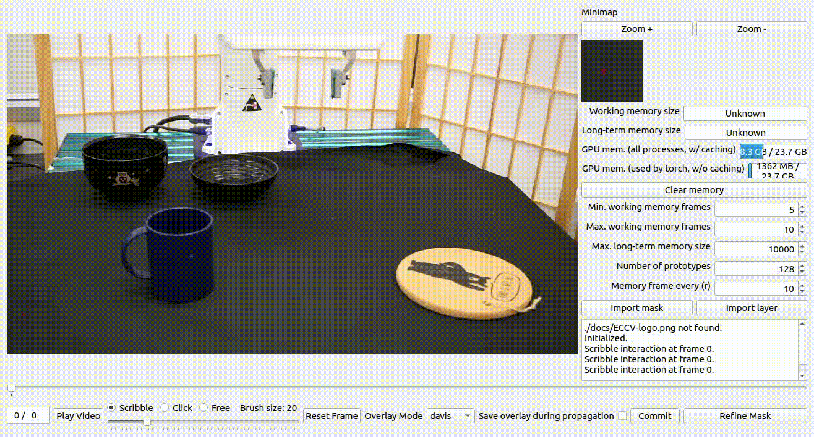

# **GROOT: Learning Generalizable Manipulation Policies with Object-Centric 3D Representations** 


<!-- 
<p align="center">

</p>
 -->
 
[Yifeng Zhu](https://www.cs.utexas.edu/~yifengz), [Zhenyu Jiang](https://zhenyujiang.me/), [Peter Stone](https://www.cs.utexas.edu/~pstone), [Yuke Zhu](https://www.cs.utexas.edu/~yukez/)


[Project](https://ut-austin-rpl.github.io/GROOT) | [Paper](https://zhuyifengzju.github.io/files/GROOT_CoRL2023.pdf) | [Video](https://youtu.be/T_wW-Mzt49M?si=dFv-NU8itv_SZUpK)


Our real robot experiments are based off of the control codebase [Deoxys](https://github.com/UT-Austin-RPL/deoxys_control) and its vision pipeline [Deoxys-Vision](https://github.com/UT-Austin-RPL/deoxys_vision) (Coming soon!).

## 1. Installation

```shell
pip install -r requirements.txt
```

If you want to use this as a component, there is a easy way to allow you to access functions in groot. Simple do the following in your virtual environment:

```shell
pip install -e .
```

### 1.1 Prerequisite

We need to install the vision models and checkpoints in order to run GROOT codebase. Here is a simple bash script that takes care of everything and also make sure that you can download the same commits of the repos as I used for my experiments. 

```
./setup_vision_models.sh
```

The resulting repo structure under `third_party` should be as follows:
```
third_party/
    dinov2
    segment-anything
    XMem
    sam_checkpoints
    xmeme_checkpoints
```

## 2. Data Collection

This repo relies on `deoxys_vision` and `deoxys_control` to collect images and control the robot (Franka Emika Panda). 

### 2.1 Reset robot states

You will first need to reset the robot to an initial joint configuration. This is to allow you collect data from a fixed iniital state distribution. 

``` 
python real_robot_scripts/deoxys_reset_joints.py
```

### 2.2 Collect data with spacemouse

Collect demonstrations for a task. Specify the task name and consistently so that the code can successfully create the datasets later.

```
python real_robot_scripts/deoxys_data_collection.py --dataset-name DATASET_NAME
```


## 3. Curate Training Datasets

To curate the training datasets, there are three things to be done:
1. create demonstrations
2. annotate single-frame segmentation
3. create point clouds to train policies fast

### 3.1 Create Demonstration Dataset

```
python real_robot_scripts/create_dataset.py --folder DEMONSTRATION_FOLDER
```

### 3.2 Annotate Single-Frame Segmentation

```
python scripts/interactive_demo_from_datasets.py --dataset_path DATASET_PATH --num_objects NUM_OBJECTS
```

By default, we assume you also annotate robotos during this process. This is for better performance of VOS without considering the robot as one of the objects, and also the GROOT policies assume that the input is including the robot point clouds, so the policy will exclude the robot's point clouds. Including this information is also beneficial for conducting ablation studies for your need. The process is adapted from the S2M GUI. 





This component is made possible by [S2M](https://github.com/hkchengrex/Scribble-to-Mask).


### 3.3 Prepare Training set

Simply run `python prepare_training_set.py dataset_path=DATASET_PATH` will do the work. The command is equivalent to the following one:

```
python prepare_training_set.py dataset_path=DATASET_PATH vos_annotation=true object_pcd=true pcd_aug=true pcd_grouping=true delete_intermediate_files=true
```

If the the script is terminated in the middle and you do not want to create the whole set of intermediate files, you can specify one of the procedure from `true` to `false` and the script will skip the corresponding operation. After this process, you will get a `masks.hdf5` that stores the result from segmentation propagation, and a `*_training_set.hdf5` file that saves all the inputs that are used during training.


## 4. Real Robot Evaluation


### 4.1 Check if your cameras are properly configured and setup.

```
python verify_camera_observations.py
```

### 4.2 Evaluation Procedural

1. Reset to initial positions

``` 
python real_robot_scripts/deoxys_reset_joints.py
```

1. Run evaluation

```
python scripts/real_robot_eval_checkpoint.py \
        --checkpoint-dir CHECKPOINT_FOLDER \
        --checkpoint-idx 100 \
        --experiment-config real_robot_scripts/eval_new_instances/eval_new_instance_3.yaml
```

**Details:**

In the new instance case, the following script will be triggered: `real_robot_scripts/real_robot_sam_result.py` and subsequently `auto_annotation/sam_amg.py`.

And there will be multiple files stored for the case of new instances:
- The first frame captured by the camera: `evaluation_results/DATASET_NAME/first_frame`
- The outputs of SAM: `evaluation_reulsts/DATASET_NAME/masks`
- The output from cosine similarity: `annotations/DATASET_NAME/evaluation_{ID}`

And the evaluation script will retrieve the image and annoation from `annotations/DATASET_NAME/evaluation_{ID}`.

1. Run checkpoints:

``` shell
python scripts/real_robot_eval_checkpoint.py --checkpoint-dir experiments_real/VOS_3D_Real_Robot_Benchmark_pogba/stamp_paper_aug/VOS3DSingleTask/VOS3DRealRobotMaskedNoWristTransformerPolicy_seed10000/run_002 --checkpoint-idx 100 --experiment-config real_robot_scripts/eval_new_instances/eval_new_instance_3.yaml
```
Some common configs are pre-defined in a yaml file, and you only need
to specify the yaml file in the argument `--experiment-config`.

If it's for testing new instances, you need to make sure that you specify the same experiment config for a single object. Otherwise the annotation used for propagating the VOS model will not match.

## 5. Code Structures

For details, please refer to `code_structure.md`
```
groot/

    # Detailed jupyter notebook to go through important components of the repo, including:
    #    - XMem tracking for robot data
    #    - Backprojection to point clouds
    #    - SAM result on robot data
    #    - DINOv2 result on robot data
    walkthrough_example.ipynb

    # Scripts that include:
    #    - Scribble to mask annotation
    #    - process dataset for faster training
    #    - Train robot policies
    #    - Evaluate robot policies
    scripts/
       
    groot_imitation/
        # Groot algo repo that stores most of the policy components
        groot_algo/
            
        # separate model for Segmentation Corresponde Model (Paper Section 3.4)
        segmentation_correspondence_model/ # segmentation correspondence model

        ## Configuration for third party models
        vision_model_configs/


    # Necessary scripts for real robot control
    real_robot_scripts/


    # third party models (Large vision models)
    ## Third party code repo
    third_party/
```
